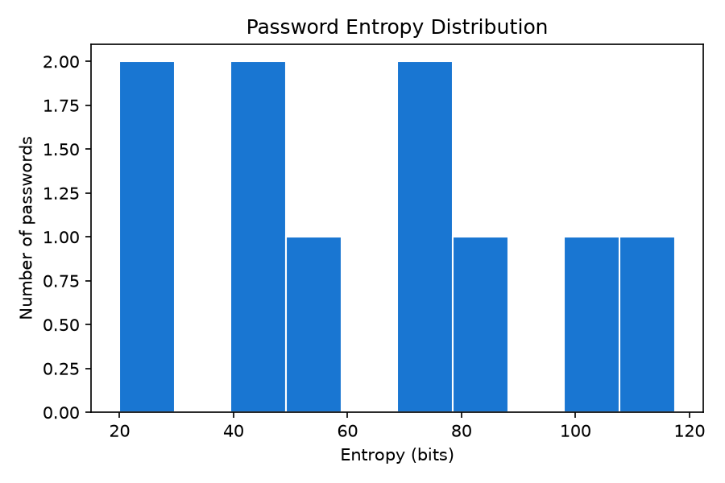
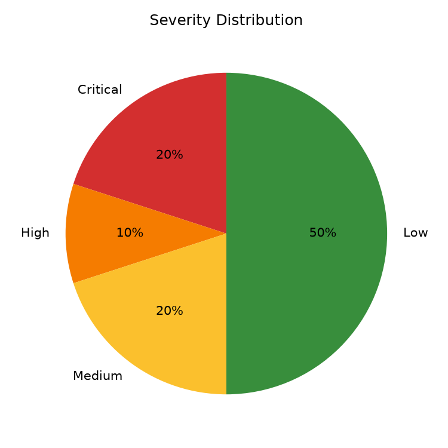
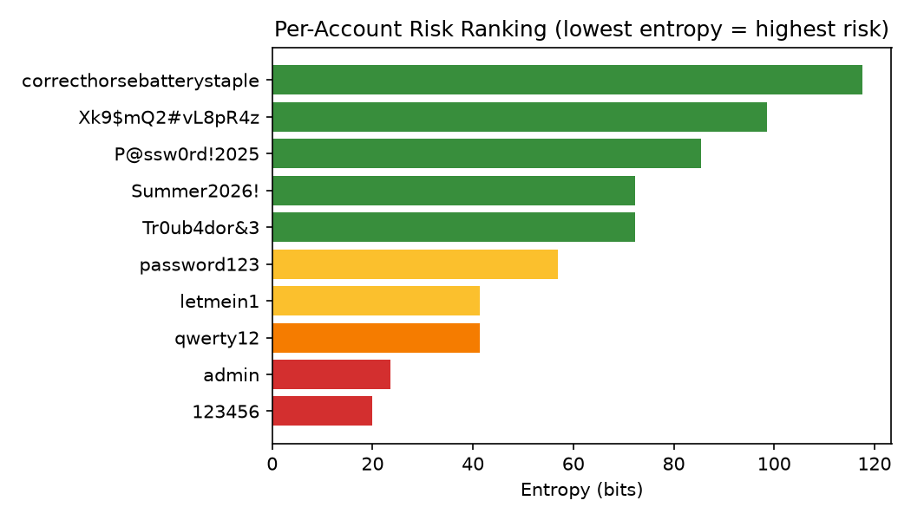

# Password Security Audit Report
_Generated: 2026-06-22T12:57:56_

## Executive Summary
- Passwords analyzed: 10
- Critical: 2  |  High: 1  |  Medium: 2  |  Low: 5

## Password Strength Analysis
| Password | Length | Entropy (bits) | Severity | Common? | Keyboard Pattern? |
|---|---|---|---|---|---|
| `password123` | 11 | 56.87 | Medium | No | No |
| `qwerty12` | 8 | 41.36 | High | No | Yes |
| `P@ssw0rd!2025` | 13 | 85.41 | Low | No | No |
| `123456` | 6 | 19.93 | Critical | Yes | Yes |
| `Tr0ub4dor&3` | 11 | 72.27 | Low | No | No |
| `admin` | 5 | 23.5 | Critical | Yes | No |
| `correcthorsebatterystaple` | 25 | 117.51 | Low | No | No |
| `Summer2026!` | 11 | 72.27 | Low | No | No |
| `letmein1` | 8 | 41.36 | Medium | No | No |
| `Xk9$mQ2#vL8pR4z` | 15 | 98.55 | Low | No | No |

## Dictionary Attack Simulation Results
_No dictionary attack simulations run._

## Brute-Force Time-to-Crack Estimates
_No brute-force estimates computed._

## NIST SP 800-63B Compliance Check
- Compliant: 6/10

| Password | NIST 800-63B Compliant? | Violations |
|---|---|---|
| `password123` | No | Matches a known compromised/commonly-used password (breach corpus). |
| `qwerty12` | Yes | None |
| `P@ssw0rd!2025` | Yes | None |
| `123456` | No | Below NIST 800-63B minimum length of 8 characters.; Matches a known compromised/commonly-used password (breach corpus).; Contains a sequential character run (e.g. '1234', 'abcd'). |
| `Tr0ub4dor&3` | Yes | None |
| `admin` | No | Below NIST 800-63B minimum length of 8 characters.; Matches a known compromised/commonly-used password (breach corpus). |
| `correcthorsebatterystaple` | Yes | None |
| `Summer2026!` | Yes | None |
| `letmein1` | No | Matches a known compromised/commonly-used password (breach corpus). |
| `Xk9$mQ2#vL8pR4z` | Yes | None |

## Visual Analytics

## Recommendations
- Increase length to at least 12 characters.
- Add uppercase letters.
- Add symbols/special characters.
- Avoid keyboard-walk patterns (e.g. qwerty, 12345).
- Add lowercase letters.
- Avoid common/dictionary passwords.
- Add digits.

## Recommended Password Policy
- Minimum length: 12 characters (14+ for privileged accounts).
- Require a mix of uppercase, lowercase, digits, and symbols.
- Block known-breached and common passwords (e.g. via Have I Been Pwned API or local blocklist).
- Enforce account lockout / rate limiting after repeated failed attempts.
- Use salted, slow hashing algorithms (bcrypt, scrypt, Argon2) for storage -- never unsalted MD5/SHA1.
- Enable multi-factor authentication wherever possible.
- Rotate credentials immediately if found in a breach dataset.